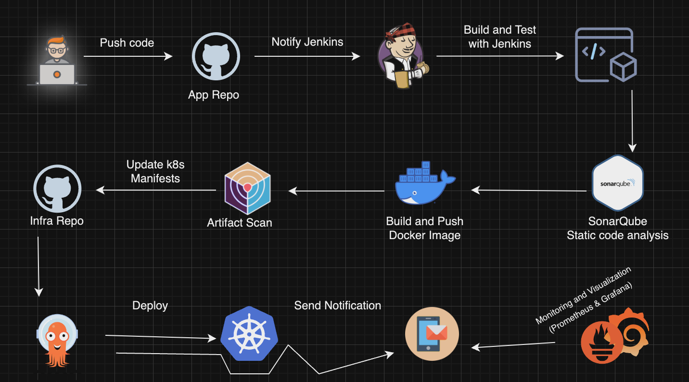

# CI/CD GitOps Projet with Terraform, EKS, Jenkins and ArgoCD.



## Stack I'll be using

- [x] **Jenkins**
- [x] **Snyk**
- [x] **Docker**
- [x] **Artifact Scan**
- [x] **ArgoCD**
- [x] **EKS**
- [x] **Prometheus**
- [x] **Grafana**

## Pre-requisities

- [x] **AWS CLI**
- [x] **Terraform**
- [x] **Helm**

Install ArgoCD

```bash
$ kubectl create namespace argocd
$ kubectl apply -n argocd -f https://raw.githubusercontent.com/argoproj/argo-cd/stable/manifests/install.yaml
$ kubectl patch svc argocd-server -n argocd -p '{"spec": {"type": "LoadBalancer"}}' # This is optional
```

Install the cluster issuer

```bash
$ kubectl apply -f certs/clusterIssuer.yaml
```
